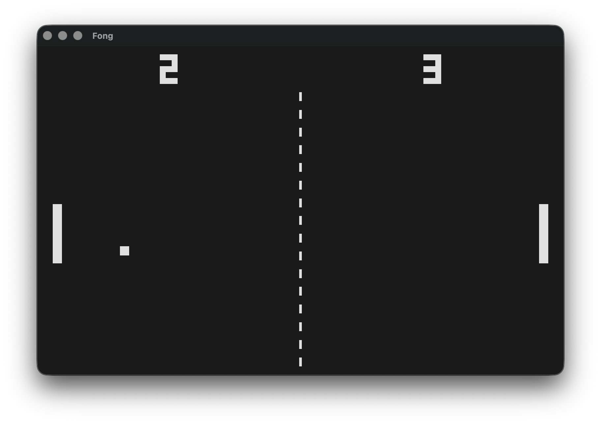

# Fong

A simple Pong clone written in Go using the [Fyne](https://fyne.io) toolkit.
Two paddles, a ball, chunky pixel scoreboards and square-wave blips — a small
tribute to the original.



## Controls

| Player | Up | Down |
| ------ | -- | ---- |
| Left   | W  | S    |
| Right  | ↑  | ↓    |

Press **Space** to pause and **M** to mute or unmute the sound — the mute state
is remembered between runs.

The ball serves automatically after a short pause. Each paddle hit adds a little
spin and nudges the pace up.

## Running

```sh
go run .
```

## Building

```sh
go build -o fong .
./fong
```

Requires Go 1.19 or newer. Audio is optional — if the speaker can't be
initialised the game runs silently.

## License

See [LICENSE](LICENSE).
